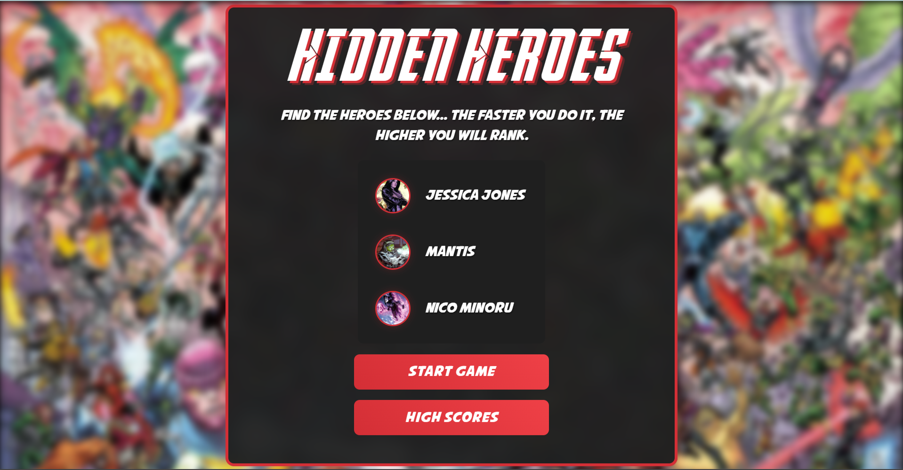
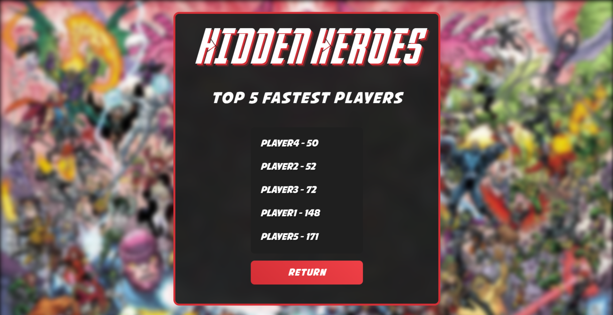
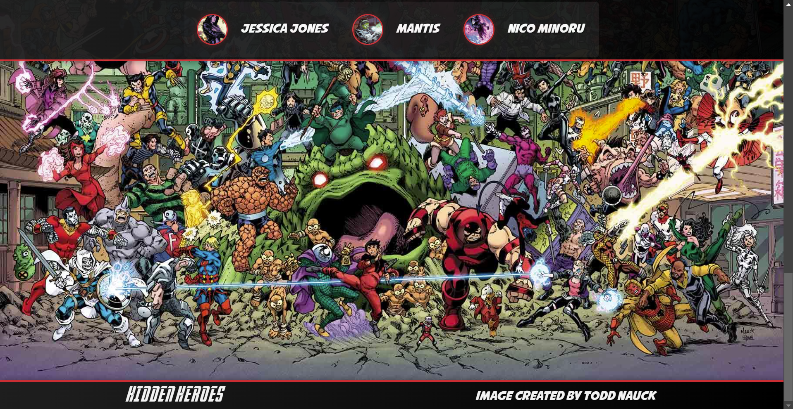

# PhotoTaggingApp

This is a Marvel inspired Where's Waldo-style photo tagging game where players must identify hidden characters within an image. The game is built with a React frontend and an Express + Prisma backend, using a PostgreSQL database to store character positions, high scores, and game sessions.

## Features

- **Interactive Image:** Users can click on an image to identify hidden characters.
- **Targeting System:** Clicking on the image places a selection box where the user can choose from a list of characters.
- **Backend Validation:** The game checks with the backend to confirm if the selection is correct.
- **Scoring System:** Tracks the time it takes for the player to find all the characters.
- **Leaderboard:** Stores high scores along with player names.
- **JWT Authentication:** Secure routes for managing game data.

## Tech Stack

### Frontend
- React (with Styled Components for UI styling)
- React Hooks for state management
- Framer Motion for animations

### Backend
- Express.js (API-only backend)
- Prisma (ORM for PostgreSQL database management)
- JWT Authentication (for secure routes)

### Database
- PostgreSQL (local database for storing character locations and high scores)

### Home Page

### High Scores

### Game Page

### Gameplay Video

